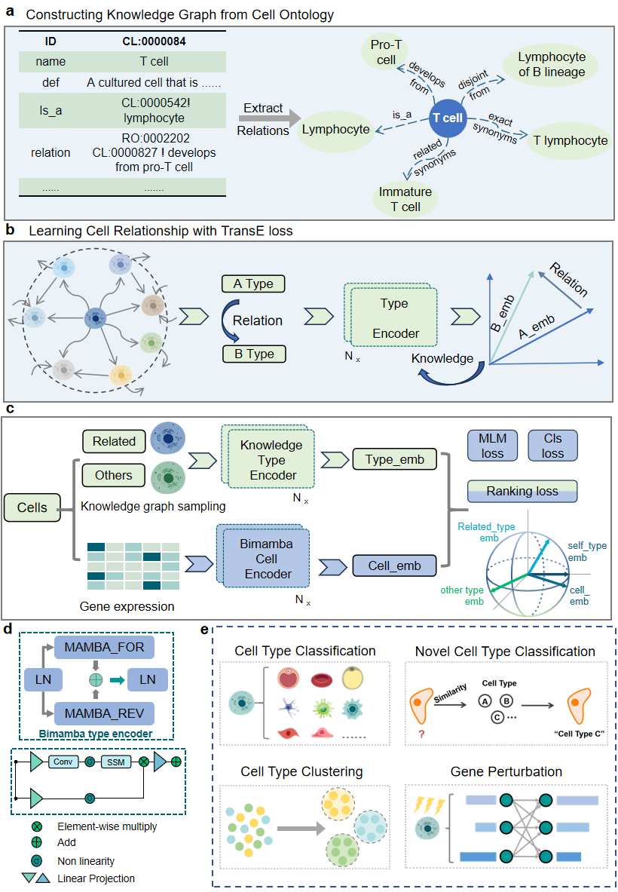

# KCFM: A Knowledge-Graph–Informed Foundation Model for Single-Cell Annotation

## Overview
KCFM is a novel framework that integrates biological knowledge from cell ontologies with single-cell sequencing data to improve cell type classification. By combining gene expression profiles with structured biological knowledge, KCFM achieves state-of-the-art performance across multiple analysis tasks.


## Quick Start
```bash
conda create -n kcfm python=3.10
conda activate kcfm
pip install -r requirements.txt
```

## Tutorial

​Step-by-step tutorials for KCFM are available at: https://github.com/nudt-bioinfo/KCFM/tree/main/KCFM_tutorial.​​
Key tutorials include:
annotation of cells within large-scale atlases:https://github.com/nudt-bioinfo/KCFM/tree/main/KCFM_tutorial/cell_atlases

annotation of fine-grained cellular subpopulations in cancer samples:https://github.com/nudt-bioinfo/KCFM/tree/main/KCFM_tutorial/T_cancer_cell

novel cell classification:https://github.com/nudt-bioinfo/KCFM/tree/main/KCFM_tutorial/novel_cell_classification/bert

spatial transcriptomics analysis under extreme data sparsity:https://github.com/nudt-bioinfo/KCFM/tree/main/KCFM_tutorial/spatial transcriptomics

gene perturbation analysis:https://github.com/nudt-bioinfo/KCFM/tree/main/KCFM_tutorial/gene_purterbation
### Knowledge-Enhanced PubMedBERT Fine-tuning
We leverage the Cell Ontology (CO) hierarchy to construct a structured knowledge graph (Fig. 1a), capturing ontological relationships between cell types (Fig. 1c). This graph informs our fine-tuning of PubMedBERT, producing cell type embeddings that intrinsically encode biological relationships.

### Pretrained KCFM Model
Our pretrained model (`cell_cls_3loss_6layer_final.pth`) integrates:
- Biological knowledge from cell ontologies
- Gene expression patterns
- Contrastive learning objectives
- Mamba2-based architecture for efficient processing

### Benchmark Evaluation
**We evaluated KCFM across five key scenarios:**

#### accurate annotation of cells within large-scale atlases


#### annotation of fine-grained cellular subpopulations in cancer samples
For the downstream task of fine-grained cell type annotation, the dataset has been publicly released via the Gene Expression Omnibus (GEO) platform (Accession number: GSE235760). This dataset includes various T cell types, such as naïve CD4+ T cells. It can be accessed through the following link: https://cellxgene.cziscience.com/collections/14dc301f-d4fb-4743-a590-aa88d5f1df1a.
```bash
python ./T_cancer_cell/run_train_T_cancer_cell_classification.py
python ./T_cancer_cell/run_test_T_cancer_cell_classification.py
```

#### novel cell classification
For the downstream task of novel cell type classification, we have collected two new cell datasets. The dataset can be accessed through the following link: https://github.com/nudt-bioinfo/KCFM/tree/main/data. novel_cell_data1 contains 75 novel cell types and approximately 300,000 cell samples. novel_cell_data2 contains 78 novel cell types and approximately 300,000 cell samples.
```bash
python ./novel_cell_classification_bert/src/run_mamba_novel_cell_classification_difficulty.py
```

#### spatial transcriptomics analysis under extreme data sparsity
We use four carefully designed existing datasets (CL-intra, CL-cross, SB-intra, SB-cross). These datasets cover both intra-tissue and cross-tissue annotation scenarios, 
with each containing only approximately 50 genes, simulating data-scarce conditions commonly encountered in real studies.

##### Cross_tissue analysis
```angular2html
python ./spatial_transcriptomics/run_train_{CL|SB}_cross.py
python ./spatial_transcriptomics/run_test.py
```

##### ​Intra-tissue analysis
```angular2html
python ./spatial_transcriptomics/run_train_{CL|SB}_intra.py
python ./spatial_transcriptomics/run_test.py
```

#### gene perturbation analysis
For the downstream task of gene perturbation analysis, the dataset can be accessed through the following link: https://github.com/nudt-bioinfo/KCFM/tree/main/KCFM_tutorial/gene%20purterbation/data.
```angular2html
python ./gene_pretubation/GEARS/gears/train.py
```

