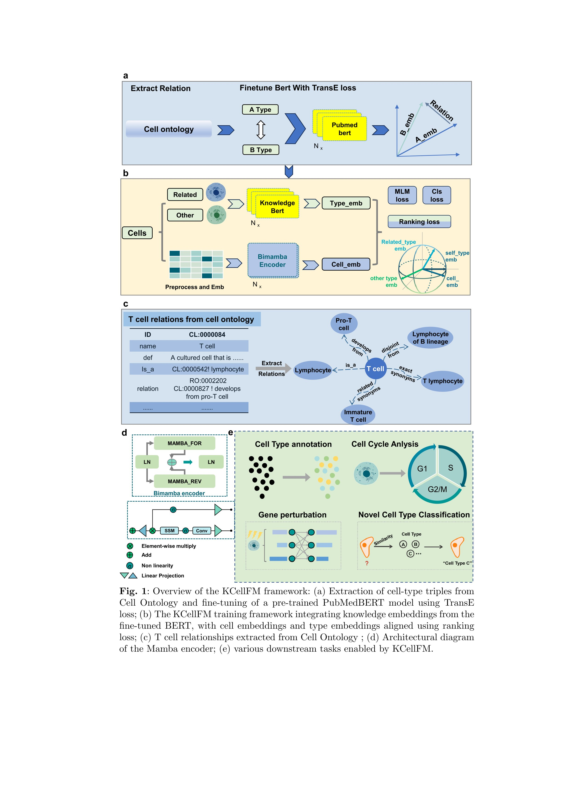

# KCellFM

* [Introduction](#introduction)
* [Updates](#updates)
* [Installation](#installationenvironment-configuration)
* [Usage](#usage)
  * [Fine-tune a PubMedBERT model](#fine-tune-a-pubmedbert-model) 
  * [Pretrained KCellFM model](#pretrained-kcellfm-model)
  * [Downstream task](#downstream-task)
    * [fine-grained cell type annotation](#fine-grained-cell-type-annotation)
    * [novel cell classification](#novel-cell-classification)
    * [spatial transcriptomics analysis under extreme data sparsity](#spatial-transcriptomics-analysis-under-extreme-data-sparsity)
    * [gene perturbation analysis](#gene-perturbation-analysis)
* [Contributing](#contributing)
* [Acknownledgements](#acknoledgements)
* [Citing KCellFM](#citing-kcellfm)

## Introduction


This is the official codebase for **KCellFM: A Knowledge-Guided Foundation Model for Cell Type Annotation in Single-Cell Data**

Single-cell sequencing has revolutionized our ability to chart cellular heterogeneity and link cell identities to health 
and disease. However, accurate cell type classification remains a major challenge, as existing approaches fail to fully harness
the scale of available data and rarely integrate structured biological knowledge. Current foundation models, while powerful, 
still rely primarily on raw expression profiles and overlook the semantics of cell identity. Here we present KCellFM, a
cell ontology–guided foundation model that couples large-scale expression learning with structured biological priors. By 
embedding the hierarchical knowledge of the Cell Ontology into model training, KCellFM establishes a principled alignment 
between expression-derived representations and biologically meaningful cell types. This design moves beyond purely data-driven 
annotation, yielding a model that is both interpretable and broadly generalizable. KCellFM demonstrates state-of-the-art accuracy 
across diverse tasks, including precise annotation of cells within large cell atlas datasets, resolution of fine-grained subpopulations 
in cancer patients, discovery of novel cell populations, and accurate annotation in spatial transcriptomics. In addition, 
it enhances modeling of perturbation responses, further extending its utility beyond static annotation.

**Keywords:** Single-cell foundation model, Single-cell data analysis, Single-cell atlas, Cell type annotation, Cell ontology

## Updates
* **October 1, 2025:** KCellFM code realeased!

## Installation(Environment Configuration)
* python 3.10.16
* pytorch 2.2.0
* pytorch-cuda 12.1
* tensorboard 2.19.0
* torchvision 0.17.0
* transformers 4.51.3
* tokenizers 0.21.1
* datasets 2.21.0
* tqdm 4.67.1
* scanpy 1.11.1
* scikit-learn 1.5.2
* scipy 1.15.2
* pandas 2.2.3
* matplotlib 3.10.1
* numpy 1.26.4
* anndata 0.11.4

## Usage

### Fine-tune a PubMedBERT model
Cell Ontology (CO) is a standardized cell type classification system. As shown in Figure 1 (/reference/fig1.jpg), this system 
defines the connections between cell types, based on which we construct a hierarchical knowledge graph that formally represents 
relationships among cell types based on established cell ontologies (Fig. 1a). This graph captures ontological relations (Fig. 1c), 
encapsulating natural hierarchical and functional connections across cell types. We then fine-tune a PubMedBERT model using
these relational structures, generating type embeddings that are inherently enriched with ontological knowledge.

Run the following command in the **/KCellFM-main/PubMedbert/** directory.
```bash
python fine_tune_PubMedbert_model.py
```
After running the command, the fine tuned PubMedBERT model can be obtained.

### Pretrained KCellFM model

Single-cell sequencing has revolutionized understanding of cellular heterogeneity, but effectively interpreting its massive 
data and accurately annotating cell types remains challenging. Most existing methods only rely on gene expression profiles, 
overlooking structured biological knowledge of cell type relationships. To address this, we introduce KCellFM, a novel multi-stage 
knowledge-guided framework that integrates prior biological knowledge into a foundational model for single-cell analysis.

Run the following command in the **/KCellFM-main/src/** directory to pretrain KCellFM model.

```bash
python train_mam.py
```
After running this command, pretrained KCellFM model (e.g. **cell_cls_3loss_6layer_final.pth**) can be obtained.

### Downstream task
KCellFM, a knowledge-guided foundational model designed to enhance single-cell data analysis by integrating structured biological 
knowledge from cell ontologies. Our approach constructs a hierarchical knowledge graph to formally represent cell type relationships, 
fine-tunes a PubMedBERT model to generate knowledge-aware cell type embeddings, and employs Mamba2-based modules with contrastive 
learning to align cell embeddings with ontological structures. This framework produces general-purpose cell representations that 
significantly improve performance across multiple downstream tasks—including fine-grained cell type annotation, novel cell discovery, 
spatial transcriptomics analysis under extreme data sparsity, and gene perturbation analysis—demonstrating both biological consistency 
and robustness to batch effects.

All downstream task codes are located in the **script** folder.

#### fine-grained cell type annotation
```angular2html
python ./T_cancer_cell/run_train_T_cancer_cell_classification.py
python ./T_cancer_cell/run_test_T_cancer_cell_classification.py
```

#### novel cell classification
```bash
python ./novel_cell_classification_bert/src/run_mamba_novel_cell_classification_difficulty.py
```

#### spatial transcriptomics analysis under extreme data sparsity
To provide a comprehensive evaluation of KCellFM’s performance, we focused on a pervasive challenge in spatially resolved 
transcriptomics (ST): accurate cell-type annotation under data-scarce conditions. we use four carefully designed existing 
datasets (CL-intra, CL-cross, SB-intra, SB-cross). These datasets cover both intra-tissue and cross-tissue annotation scenarios, 
with each containing only approximately 50 genes, simulating data-scarce conditions commonly encountered in real studies.

**CL_cross**

Fine-tune the KCellFM model using the CL_cross dataset, and then test the performance of the fine-tuned model on the test set.

```angular2html
python ./空转/run_train_CL_cross.py
python ./空转/run_test.py
```

**CL_intra**

Fine-tune the KCellFM model using the CL_intra dataset, and then test the performance of the fine-tuned model on the test set.

```angular2html
python ./空转/run_train_CL_intra.py
python ./空转/run_test.py
```

**SB_cross**

Fine-tune the KCellFM model using the SB_cross dataset, and then test the performance of the fine-tuned model on the test set.

```angular2html
python ./空转/run_train_SB_cross.py
python ./空转/run_test.py
```

**SB_intra**

Fine-tune the KCellFM model using the SB_intra dataset, and then test the performance of the fine-tuned model on the test set.

```angular2html
python ./空转/run_train_SB_intra.py
python ./空转/run_test.py
```

**Cell Cycle Analysis**

Unlike CL indra, CL cross, SB indra, SB cross, the data of cell cycle analysis reflects the characteristic of extremely 
small sample size, that is, the sample size is scarce.
```angular2html
python ./cell_cycle_classification/run_cell_cycle_classification.py
```

#### gene perturbation analysis
```angular2html
python ./gene_pretubation/GEARS/gears/train.py
```

## Contributing

## Acknoledgements

This study has been supported by xxx and the National Natural Science Foundation of China Youth Program (62402071).


## Citing KCellFM

```bibtex
@article{
title={KCellFM: A Knowledge-Guided Foundation Model for Cell Type Annotation in Single-Cell Data},
author={},
journal={Nature Machine Intelligence},
year={2025},
publisher={}
}
```